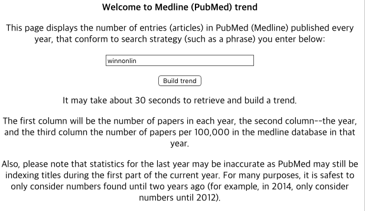

# Introduction and Methods

The number of publications containing NONMEM was retrieved from the Pubmed search at 2017-04-27 14:30 KST through [Medline (PubMed) trend website](http://dan.corlan.net/medline-trend.html) and the fetched data was processed by R 3.4.0 [@R-base] and ggplot2 [@R-ggplot2].



# Results

Results from a PubMed search for the term, NONMEM and WinNonLin were plotted against the year the publication appeared.

```{r setup, message = FALSE, results = 'hide'}
library(knitr)
library(ggplot2)
library(dplyr)
library(tibble)
library(tidyr)
```

```{r eval = FALSE}
Pubmed <- list()

# Read Medline Trend data
Pubmed$winnonlin <- readLines("http://dan.corlan.net/cgi-bin/medline-trend?Q=winnonlin")
Pubmed$nonmem <- readLines("http://dan.corlan.net/cgi-bin/medline-trend?Q=nonmem")

# Data Prep
PubmedPrep <- function(x) data.frame(raw = Pubmed[[x]]) %>%
    filter(!grepl("Medline|Number|PRE", raw)) %>%
    mutate(raw = trimws(raw)) %>%
    separate(col = "raw", into = c("number", "year", "freq"), sep = "[^[:alnum:]|^.]+") %>%
    mutate_all(as.numeric) %>%
    mutate(term = x)

Dataset <- bind_rows(lapply(names(Pubmed), PubmedPrep)) %>%
    arrange(year) %>% 
    filter(year >= 1980) # First appearance is in 1980.

RawData <- Dataset %>% 
    select(-freq) %>% 
    arrange(year) %>% 
    spread("term", value = "number")
```

```{r eval = FALSE, include = FALSE}
save(Dataset, RawData, file = "~/shanmdphd/pubmed/Dataset.Rdata")
```

```{r include = FALSE}
load("~/shanmdphd/pubmed/Dataset.Rdata")
```

## Bar Plots

```{r fig.cap = "Publications utilizing NONMEM or WinNonLin"}
ggdata <- Dataset %>% 
    filter(term == "nonmem")

gg1 <- ggplot(data=ggdata, aes(x=year, y=number)) +
    geom_bar(stat="identity") + 
    guides(fill=FALSE) +
    xlab("Year") + ylab("Number of Articles") +
    ggtitle("Number of Articles Using NONMEM")+
    scale_y_continuous(limits = c(0, 200))
gg1

ggdata <- Dataset %>% 
    filter(term == "winnonlin")# %>% 
    #filter(number != 0)
    
gg2 <- ggplot(data=ggdata, aes(x=year, y=number)) +
    geom_bar(stat="identity") + 
    guides(fill=FALSE) +
    xlab("Year") + ylab("Number of Articles") +
    ggtitle("Number of Articles Using WinNonLin")+
    scale_y_continuous(limits = c(0, 200))
gg2
```

```{r}
ggplot(Dataset, aes(x=year, y=number, fill=term)) +
    geom_bar(stat="identity", position=position_dodge()) +
    ggtitle("Number of Articles Using NONMEM or WinNonLin") +
    xlab("Year") + ylab("Number of Articles") +
    scale_y_continuous(limits = c(0, 200))
```

## Line Plots

```{r}
ggplot(Dataset, aes(x=year, y=number, colour=term, group=term)) +
    geom_line() + 
    xlab("Year") + ylab("Articles") +
    ggtitle("Number of Articles Using NONMEM or WinNonLin") +
    xlab("Year") + ylab("Number of Articles")
```

```{r}
ggplot(Dataset, aes(x=year, y=freq, colour=term, group=term)) +
    geom_line() + 
    xlab("Year") + ylab("Articles per 100,000 in each year)") +
    ggtitle("Normalized Number of Articles Using NONMEM or WinNonLin")
```

## Raw data

Results from a PubMed search for the term, NONMEM were listed. 

```{r}
knitr::kable(RawData, caption = "Raw data of the number of publications utilizing NONMEM.")
```

# Conclusion

The total number of articles using NONMEM is `r sum(RawData$nonmem)` and the total number of articles using WinNonLin is `r sum(RawData$winnonlin)`.

The number of publications utilizing NONMEM or WinNonLin tends to increase. The percentage of the number of papers per 100,000 in the medline database in each year also increases but articles using NONMEM seem to increase faster.

# References

```{r include = FALSE}
knitr::write_bib(file = "packages.bib")
```

